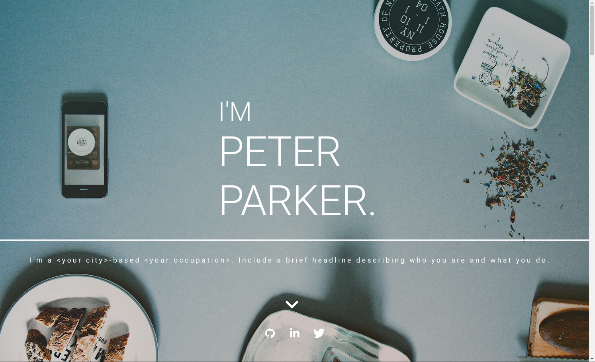

# ReactJS Web App Portfolio Template      

### <a href="https://web-portfolio-template.herokuapp.com/">LIVE DEMO</a> 

## Description
This is a web portfolio template build with ReactJS. Once this project is cloned, only one step is required to customize the data with your own: fill in the values in the public/resumeData.json file. To alter fonts, backgrounds, and any images, just edit the properties in the 'styles' const at the top of each component file, and replace images in the public/images folder. The process is simple, it's fast, and it's explained below.

## Requirements
To build this website, you will need to have Node >=6 downloaded and installed on your machine. If you don't already have it, you can [download it here](https://nodejs.org/en/download/).

## Build Your Web Portfolio
### Install dependencies and start the app:
This project was bootstrapped with [Create React App](https://github.com/facebook/create-react-app).
In the project directory, you can run:
```
yarn install
```
Installs dependencies.
```
yarn start
```
Runs the app in development mode.<br/>
Open [http://localhost:3000](http://localhost:3000/) to view it in the browser.

### Fill in your personal info:
To populate the website with all of your own data, open the public/resumeData.json file and simply replace the data in there with your own. Images for the porfolio section are to be put in the public/images/portfolio, and images references in the tools section are to be placed in the public/images/tools folder.
Remember to replace the site title in the title tag of public/index.html.

### Replace images and fonts:
Next, you will want to replace the images, and fonts if you like, with your own.
#### Fonts and Colors
Fonts, font colors, background-colors, and certain styling attributes you may want to change are located in the 'styles' const at the top of each component. For example, to edit font color and background color of the 'About Me' section, you would navigate to src/components/AboutMe.js and here you would edit the CSS styling:
```
const styles = theme => ({
    typography: {
      color: '#ffffff'
    },
    aboutMePageWrapper: {
        backgroundColor: '#71e3bd',
    }
// ...etc
});
```
To change social icon fill color, search for the &lt;SocialIcons&gt; tags, and change the fill attributes, which can include: 'fill', 'fillInMasthead', 'fillBelowMasthead'
 and the 'hoverFill'.

To change anything beyond this, edit the component's module.css file.

#### Images
**public/images:** contains the masthead backgound (masthead-background.png), portfolio projects background (portfolio-background.png), and the profile image (self-porttrait.png).
<em>YOU MUST KEEP THE SAME NAMES ON THESE IMAGES.</em>

**public/images/tools:** contains the icons used in the Resume - Favorite Tools & Technologies section. Note that these image names must be the same as those referenced in the the tools object array of the resumeData.json file.

**public/images/portfolio:** contains the images used in the grid list for portfolio projects. These image names must be the same as those referenced in the projects array of the resumeData.json file.

## ... & that's it.
Enjoy your customized web portfolio.


## Built With

Some of the key tools and technologies used to build this application:

* [ReactJS](https://reactjs.org/) - JavaScript library used to build the UI.
* [Material-UI](https://material-ui.com/) - React UI Framework (Google's material design UI components built with React.)
* [Axios](https://github.com/axios/axios) - Promise based HTTP client for the browser and node.js

<br/>

## Authors

* **Dani Sestan** - *Initial work* - [DaniSestan](https://github.com/DaniSestan)

<br/>

## License

This work is licensed under the Creative Commons Attribution-ShareAlike 4.0 International License. To view a copy of this license, see the [LICENSE.md](https://github.com/DaniSestan/CheckMate/blob/master/LICENSE.md) file.
